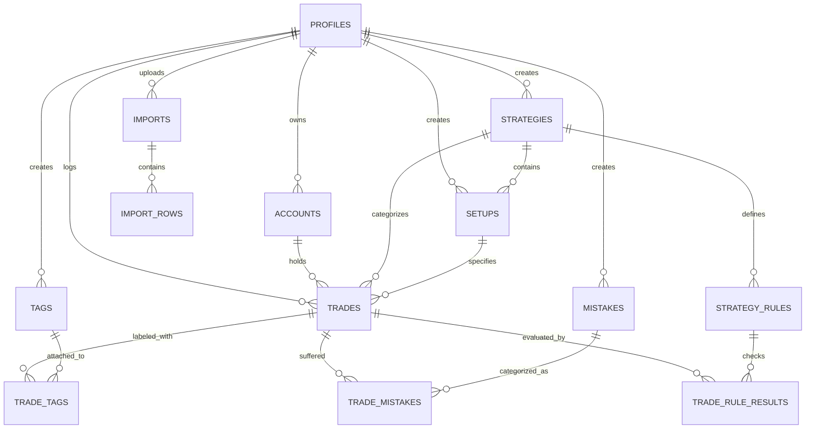

# Database Model & Schema Evolution - TradeLab

## 1. Relational Entity-Relationship Diagram



---

## 2. Table Specifications & Evolutions

### A. `profiles`
- `id` (UUID, PK, FK auth.users)
- `email` (TEXT)
- `currency` (TEXT DEFAULT 'USD')
- `timezone` (TEXT DEFAULT 'UTC')
- `created_at` (TIMESTAMPTZ)
- `updated_at` (TIMESTAMPTZ)

### B. `accounts`
- `id` (UUID, PK)
- `user_id` (UUID, FK auth.users)
- `name` (TEXT NOT NULL)
- `broker` (TEXT)
- `account_type` (TEXT DEFAULT 'personal') -- personal, broker, prop_firm, crypto, demo
- `initial_balance` (NUMERIC(15,2) NOT NULL DEFAULT 10000.00)
- `current_balance` (NUMERIC(15,2))
- `currency` (TEXT NOT NULL DEFAULT 'USD')
- `is_default` (BOOLEAN NOT NULL DEFAULT FALSE)
- `is_prop_firm` (BOOLEAN DEFAULT FALSE)
- `prop_firm_name` (TEXT)
- `phase` (TEXT)
- `profit_target` (NUMERIC(15,2))
- `daily_loss_limit` (NUMERIC(15,2))
- `max_loss_limit` (NUMERIC(15,2))
- `status` (TEXT DEFAULT 'active')
- `created_at` (TIMESTAMPTZ)
- `updated_at` (TIMESTAMPTZ)

### C. `strategies` & `setups`
- `strategies`:
  - `id` (UUID, PK)
  - `user_id` (UUID, FK auth.users)
  - `name` (TEXT NOT NULL)
  - `description` (TEXT)
  - `market` (TEXT)
  - `preferred_session` (TEXT)
  - `preferred_timeframe` (TEXT)
  - `active` (BOOLEAN DEFAULT TRUE)
  - `created_at` / `updated_at` (TIMESTAMPTZ)
- `setups`:
  - `id` (UUID, PK)
  - `user_id` (UUID, FK auth.users)
  - `strategy_id` (UUID, FK strategies(id) ON DELETE SET NULL)
  - `name` (TEXT NOT NULL)
  - `description` (TEXT)
  - `entry_criteria` (TEXT)
  - `confirmation_rules` (TEXT)
  - `invalidation_rules` (TEXT)
  - `created_at` / `updated_at` (TIMESTAMPTZ)

### D. `strategy_rules` & `trade_rule_results`
- `strategy_rules`:
  - `id` (UUID, PK)
  - `user_id` (UUID, FK auth.users)
  - `strategy_id` (UUID, FK strategies(id) ON DELETE CASCADE)
  - `title` (TEXT NOT NULL)
  - `description` (TEXT)
  - `rule_type` (TEXT CHECK (rule_type IN ('ENTRY', 'CONFIRMATION', 'RISK', 'MANAGEMENT', 'EXIT')))
  - `required` (BOOLEAN DEFAULT TRUE)
  - `sort_order` (INT DEFAULT 0)
- `trade_rule_results`:
  - `id` (UUID, PK)
  - `trade_id` (UUID, FK trades(id) ON DELETE CASCADE)
  - `rule_id` (UUID, FK strategy_rules(id) ON DELETE CASCADE)
  - `followed` (BOOLEAN NOT NULL)
  - `notes` (TEXT)

### E. Normalized Mistakes & Psychology
- `mistakes`:
  - `id` (UUID, PK)
  - `user_id` (UUID, FK auth.users)
  - `name` (TEXT NOT NULL)
  - `category` (TEXT)
- `trade_mistakes`:
  - `trade_id` (UUID, FK trades(id) ON DELETE CASCADE)
  - `mistake_id` (UUID, FK mistakes(id) ON DELETE CASCADE)
  - PRIMARY KEY (`trade_id`, `mistake_id`)
- Psychology in `trades`:
  - `emotion_before` (TEXT)
  - `emotion_during` (TEXT)
  - `emotion_after` (TEXT)

### F. Multi-Asset & Timestamps in `trades`
- `asset_class` (TEXT DEFAULT 'crypto') -- stock, crypto, forex, future, option, index, cfd, other
- `contract_multiplier` (NUMERIC(10,4) DEFAULT 1.0)
- `tick_size` (NUMERIC(18,6))
- `tick_value` (NUMERIC(18,6))
- `entry_at` (TIMESTAMPTZ) -- Canonical timestamp in UTC
- `exit_at` (TIMESTAMPTZ) -- Canonical timestamp in UTC
- `mae` (NUMERIC(18,6)) -- Maximum Adverse Excursion
- `mfe` (NUMERIC(18,6)) -- Maximum Favorable Excursion

---

## 3. Database Migration Roadmap

```text
supabase/migrations/
├── 001_initial_schema.sql
├── 002_trade_status_and_timestamps.sql
├── 003_asset_class_and_multipliers.sql
├── 004_strategy_setup_relationship.sql
├── 005_mistakes_normalization.sql
├── 006_strategy_rules_and_execution.sql
├── 007_psychology_lifecycle.sql
├── 008_account_model_expansion.sql
└── 009_multi_tenant_integrity_triggers.sql
```
